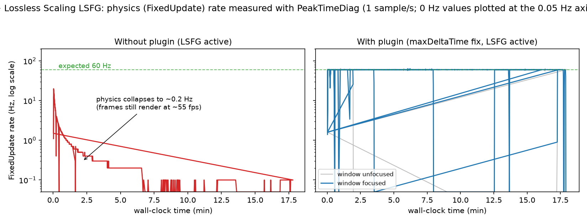
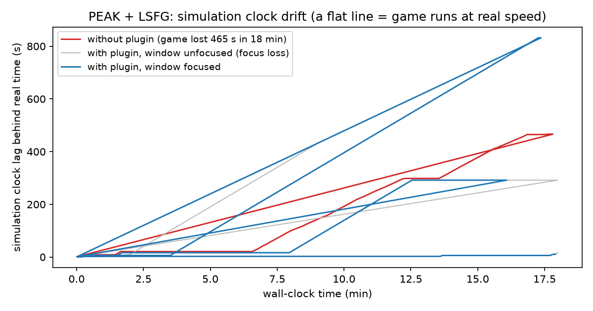

# PEAK LS Compat

BepInEx plugin that makes [Lossless Scaling](https://store.steampowered.com/app/993090/Lossless_Scaling/) (LSFG frame generation) safe to use with **PEAK**.

Without it, activating LS frame generation can make the whole game run in slow motion (physics, gravity, player speed — everything). This happens because Unity clamps `Time.deltaTime` at `Time.maximumDeltaTime` (0.1667 s) whenever a frame takes longer than that, which is common while an external capture/overlay interacts with the game's presentation path. The plugin removes that time loss and keeps the simulation locked to real time.

Works on **any GPU** — the plugin touches no graphics APIs, only engine timing settings.

## Evidence

Measured on a GTX 1650 Ti laptop, PEAK @1080p, LSFG ×2 active, using a custom BepInEx telemetry plugin (PeakTimeDiag, 1 sample/s). Same machine, two sessions: vanilla game vs. game with the timing fix applied.



**Without the plugin**, frames keep rendering at ~55 fps while the physics loop (`FixedUpdate`) collapses from 60 Hz to **0.2–0.3 Hz** — that gap *is* the slow motion: the renderer draws new frames, but the simulation advances at ~0.5% of real speed. **With the plugin**, `FixedUpdate` holds 60 Hz for as long as the game window is focused.



**Without the plugin** the simulation clock falls 465 s behind real time in 18 minutes (the game world effectively "skips" almost 8 minutes of physics). **With the plugin**, the lag stays flat during focused play. Grey periods are windows where the game lost focus — background throttling still costs time there, which is why the plugin also forces `runInBackground` and why the LS overlay setup matters.

Raw CSVs and the plotting script are in [`tools/`](tools/) (`PeakTimeDiag.csv` = vanilla, `PeakTimeDiag2.csv` = fixed) — regenerate the figures with `python tools/plot_evidence.py tools/PeakTimeDiag.csv tools/PeakTimeDiag2.csv`.

## Install (manual)

1. Install [BepInEx 5.x for PEAK](https://thunderstore.io/c/peak/p/BepInEx/BepInExPack_PEAK/) (required, plugin depends on it).
2. Download `PeakLSCompat.dll` from [Releases](../../releases).
3. Copy it to `PEAK/BepInEx/plugins/`.

That's it. A safe config is generated on first launch at `BepInEx/config/com.black.peaklscompat.cfg`.

## Recommended Lossless Scaling setup (validated empirically)

**Any GPU:**

- Game in **borderless fullscreen** (not exclusive)
- Capture API: **WGC** (Windows 11 24H2+), Max Frame Latency **2**
- **G-Sync support OFF** unless your display actually supports G-Sync
- **Scaling Type: Off** — frame generation only
- LSFG mode: **Fixed ×2**, target ≈ monitor refresh (or slightly below)
- In `config.ini` (LS install folder): set `show_captured = 0` so the FPS counter shows the **output** framerate (with generated frames), not the base

**Weak GPUs (e.g. GTX 1650 Ti):** frame gen costs real GPU headroom (capture + interpolation ≈ 15–25 fps of base). Measured on a GTX 1650 Ti with PEAK @1080p:

| Config | Base (real) | Output (felt) |
|---|---|---|
| No LS | ~60 | ~60 |
| Upscale LS1 ×1.5 + FG ×2 | 32 | 65 |
| FG ×2 only @1080p | 47–52 | 105 peak |
| **FG ×2 only, game at 720p (best)** | ~45 | **~90 stable** |

→ **Do not combine upscaling with frame gen on weak GPUs** — the upscale's cost ate more than it freed. Instead, lower the **game's own resolution** (e.g. 1280×720) and let the monitor stretch it; with the plugin's `HalfRefresh` cap the base stays smooth and FG ×2 delivers up to the full refresh rate. Verified playable in-game with near-native responsiveness.

**Important:** close **MSI Afterburner / RivaTuner (RTSS)** while playing. Their Present hooks interfere with LS capture and cause heavy blur/ghosting artifacts (confirmed by testing).

## Config options

| Option | Default | What it does |
|---|---|---|
| `FixMaximumDeltaTime` | `true` | Stops the slow-motion bug. Keep on. |
| `MaximumDeltaTime` | `1.0` | Max real seconds per frame accepted. |
| `ForceRunInBackground` | `true` | Keeps sim running while the LS overlay holds focus. |
| `ForceTargetFrameRateMode` | `HalfRefresh` | Caps base framerate to half your monitor refresh (stable input for LSFG). `Off` / `Fixed` / `HalfRefresh`. |
| `ForceTargetFrameRateValue` | `60` | Cap used when mode is `Fixed`. |
| `EnableOverlay` | `false` | On-screen status overlay (F8 toggles). Off for max performance. |

## Build

```
csc.exe -nologo -nostdlib- -noconfig -target:library -optimize+ ^
  -r:netstandard.dll -r:System.dll -r:BepInEx.dll ^
  -r:UnityEngine.CoreModule.dll -r:UnityEngine.dll -r:UnityEngine.IMGUIModule.dll ^
  -out:PeakLSCompat.dll Plugin.cs
```

## License

MIT
